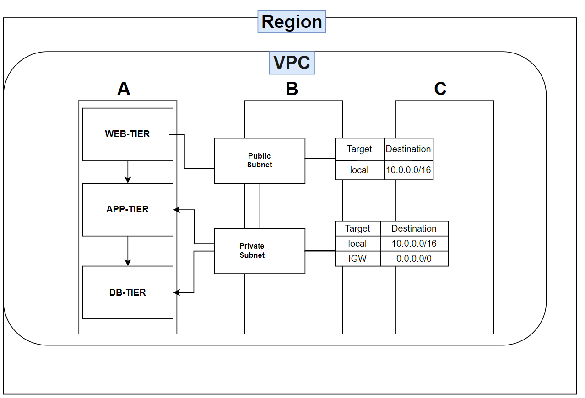
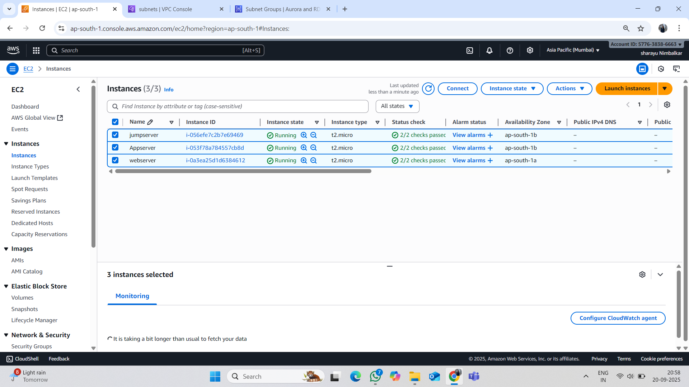
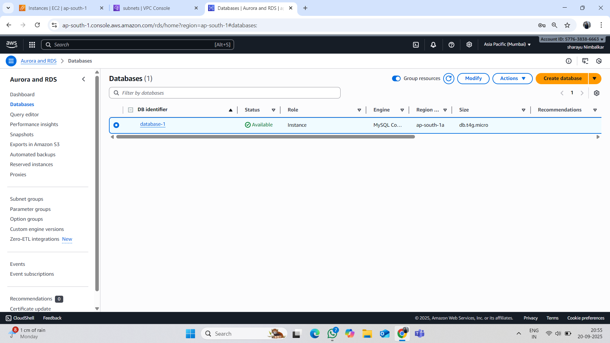
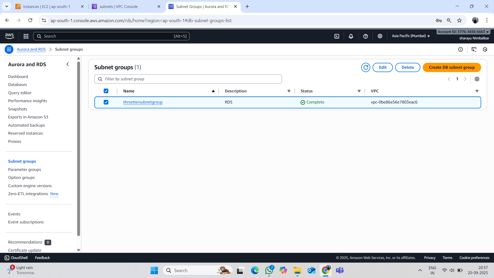
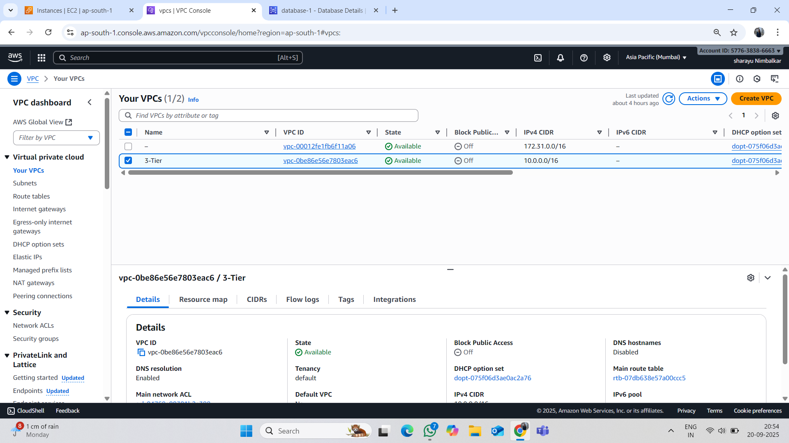
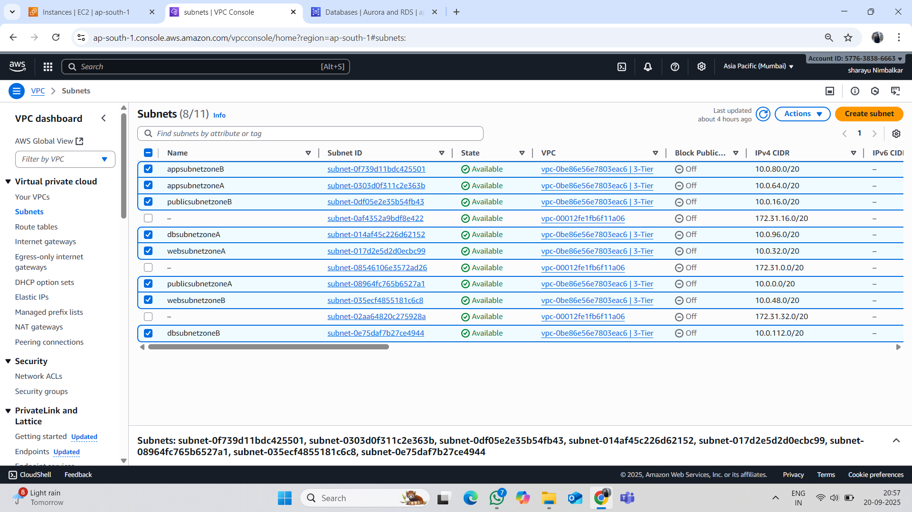
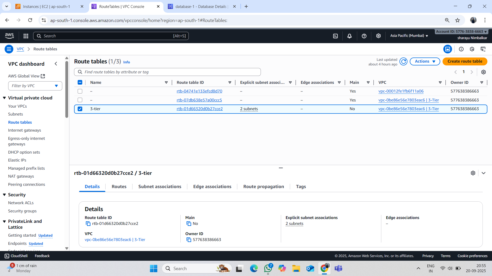
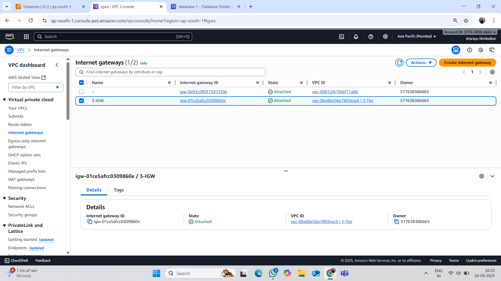
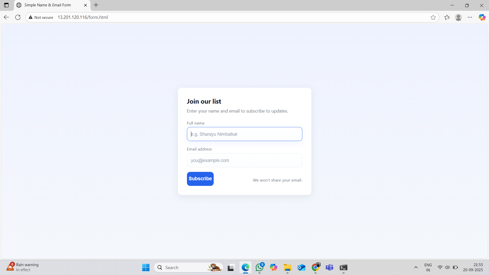

3-Tier-Architecture
Three-Tier Architecture on AWS

## Overview

This project demonstrates the deployment of a Three-Tier Architecture on AWS.
The architecture separates the application into Presentation Layer, Application Layer, and Database Layer for scalability, security, and high availability.

## Architecture Diagram  

## Security

Public Subnet: Presentation Layer (accessible to internet).

Private Subnet: Application + Database Layer.

Security Groups & NACLs: Control inbound/outbound traffic.

IAM Roles: For EC2 to securely access RDS or S3.

## AWS Services Used

VPC → Custom networking with public & private subnets

EC2 → Web/App servers

RDS → Database backend

ELB → Load balancing user traffic

Auto Scaling Group → Scalability & high availability

S3 (Optional) → Static content hosting / backups

CloudWatch → Monitoring & logging

## Deployment Steps

Step 1:

Create a VPC with public and private subnets.

Step 2:

Deploy EC2 instances in respective subnets.

Step 3:

Configure Application Load Balancer (ALB) to route traffic.

Step 4:

Set up Auto Scaling Group for the app layer.

Step 5:

Launch an RDS instance in private subnet for data storage.

Subnet Group of RDS

Step 6:

Secure with Security Groups (e.g., Web → App → DB).

VPC

Subnet

Route Table

Internet Gateway

Step 7:

Deploy your web app on EC2 and connect it to RDS.

## Conclusion

The 3-tier architecture separates an application into three layers: presentation, logic, and data. This makes the system easier to manage, scale, and maintain.
Each layer can be updated independently, improving performance, security, and overall reliability of the application.
