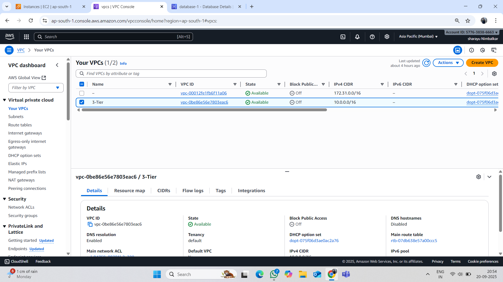

3-Tier-Architecture
Three-Tier Architecture on AWS
📌 Overview

This project demonstrates the deployment of a Three-Tier Architecture on AWS.
The architecture separates the application into Presentation Layer, Application Layer, and Database Layer for scalability, security, and high availability.
.

🏗️ Architecture Layers
1️⃣ Presentation Layer (Frontend)

Runs on Amazon EC2 / Elastic Load Balancer (ALB).

Hosts a web server (Apache/Nginx) serving HTML, CSS, JavaScript, or PHP.

Handles all incoming user requests.

2️⃣ Application Layer (Backend / Business Logic)

Deployed on EC2 instances (Auto Scaling enabled).

Contains the business logic (e.g., PHP, Python Flask, Node.js).

Communicates between the frontend and the database securely.

3️⃣ Database Layer

Uses Amazon RDS (MySQL/PostgreSQL) or Amazon Aurora.

Stores user data and application records.

Runs in a private subnet (not directly accessible from the internet).

🔐 Security

Public Subnet: Presentation Layer (accessible to internet).

Private Subnet: Application + Database Layer.

Security Groups & NACLs: Control inbound/outbound traffic.

IAM Roles: For EC2 to securely access RDS or S3.

⚙️ AWS Services Used

VPC → Custom networking with public & private subnets

EC2 → Web/App servers

RDS → Database backend

ELB → Load balancing user traffic

Auto Scaling Group → Scalability & high availability

S3 (Optional) → Static content hosting / backups

CloudWatch → Monitoring & logging

🚀 Deployment Steps

Create a VPC with public and private subnets.

Deploy EC2 instances in respective subnets.

Configure Application Load Balancer (ALB) to route traffic.

Set up Auto Scaling Group for the app layer.

Launch an RDS instance in private subnet for data storage.

Secure with Security Groups (e.g., Web → App → DB).

Deploy your web app on EC2 and connect it to RDS.

🏗 Architecture Diagram  

